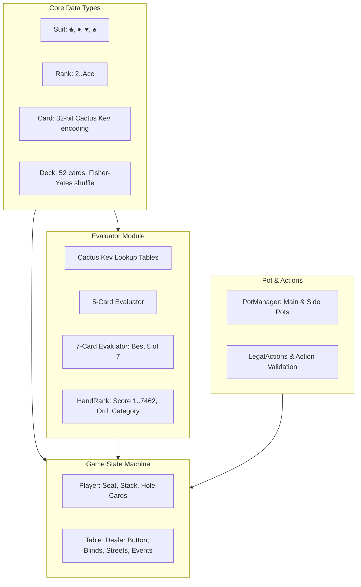

# poker-engine ♠️♥️♦️♣️

[](https://www.rust-lang.org)
[]()
[](LICENSE)

A high-performance, modular, and feature-complete **No-Limit Texas Hold'em (NLHE)** poker engine written in idiomatic Rust.

Designed for AI/bot development, Monte Carlo simulations, server backends, and interactive gameplay.

---

## Features

- ⚡ **High-Speed Bitwise Hand Evaluator**:
  - Implements the classic Cactus Kev 32-bit card representation and perfect-hash/binary-search lookup tables.
  - Supports 5-card, 6-card, and 7-card evaluations.
  - Invertible monotonic `HandRank` score ($1$ to $7462$, with $7462$ being Royal Flush) implementing standard Rust `Ord`.
  - Natural human-readable hand descriptions (*"Full House, Aces full of Kings"*, *"Two Pair, Kings and Fives with Jack kicker"*).
- 🎲 **Complete NLHE Betting State Machine**:
  - Strict round transitions: **Preflop $\to$ Flop $\to$ Turn $\to$ River $\to$ Showdown $\to$ Hand Ended**.
  - Small Blind & Big Blind rotation, dealer button management, and heads-up rules.
  - Full action set: `Fold`, `Check`, `Call`, `Bet`, `Raise`, and `AllIn`.
  - Enforces min-raise increment rules and handles all-in under-raise action reopening.
  - Automatic board runout when remaining players are all-in.
  - Early round termination when players fold around to a single survivor.
- 💰 **Robust Side Pot & Split Pot Accounting**:
  - Automatically calculates discrete main pots and multi-tier side pots for arbitrary uneven all-in player stacks.
  - Absorbs dead money from folded players.
  - Automatic refund of uncalled bets.
  - Official WSOP/casino odd-chip rule: remainder chips go to the player closest clockwise to the dealer button.
  - Strictly verified zero-leak chip conservation across multi-hand simulations.
- 📡 **Event-Driven Architecture**:
  - Emits typed events (`HandStarted`, `BlindPosted`, `PlayerActed`, `StreetStarted`, `Showdown`, `PotAwarded`) for easy integration with GUI frontends, bots, and loggers.
- 🎮 **Interactive CLI & Benchmark Suite**:
  - Playable colored terminal interface against heuristic AI bots (`--play`).
  - Headless benchmark runner simulating **~30,000 full multi-street hands per second** (`--simulate`).

---

## Architecture Overview



---

## Quick Start

### Prerequisites
- [Rust toolchain](https://rustup.rs/) (version 1.85+ / 2024 edition).

### Build & Run Tests
```bash
# Clone the repository
git clone https://github.com/your-username/poker-engine.git
cd poker-engine

# Run the complete test suite (21 unit & integration tests)
cargo test --all-targets

# Check formatting and clippy lints
cargo clippy --all-targets -- -D warnings
cargo fmt -- --check
```

---

## CLI Usage

### Interactive Game vs Bots
Play Texas Hold'em directly in your terminal against 3 automated bots:
```bash
cargo run -- --play
```

Example output:
```text
=================================================
       WELCOME TO THE RUST POKER ENGINE          
=================================================
You are sitting at Seat 0 (Hero) against 3 automated bots.

-------------------------------------------------
Starting Hand #1 | Blinds: 10/20
Dealer Button is at Seat 0
Your Hole Cards: [7♠ 9♣]
Bot Diana chooses: Call

--- Your Turn (Pot: 50) ---
Board: [K♦ 5♠ 8♥]
Options ([f]old | [ch]eck | [b]et <20-980> | [a]ll-in (980)): ch
Bot Bob chooses: Check
Bot Charlie chooses: Bet(40)
...

=== Hand Results ===
Final Board: [K♦ 5♠ 8♥ J♦ 4♣]
  Bot Charlie shows [K♠ Q♣] -> Pair of Kings
  Bot Diana shows [K♣ 5♥] -> Two Pair, Kings and Fives with Jack kicker
  Bot Diana wins Pot #0 (180 chips) with Two Pair, Kings and Fives with Jack kicker
```

### High-Speed Simulation Benchmark
Benchmark the engine's throughput with simulated bot play:
```bash
cargo run --release -- --simulate 50000
```

Sample benchmark output:
```text
Starting simulation benchmark of 50000 hands...

=== Simulation Benchmark Results ===
Hands Completed: 50000
Time Elapsed:    1.682 seconds
Throughput:      29724 hands/second
```

---

## Library Usage

Add this to your `Cargo.toml`:
```toml
[dependencies]
poker-engine = { path = "." }
```

### 1. Evaluating Hands

```rust
use poker_engine::card::Card;
use poker_engine::evaluator::{evaluate_5, evaluate_7, HandCategory};
use std::str::FromStr;

fn main() {
    // 5-card evaluation
    let royal_flush = [
        Card::from_str("As").unwrap(),
        Card::from_str("Ks").unwrap(),
        Card::from_str("Qs").unwrap(),
        Card::from_str("Js").unwrap(),
        Card::from_str("Ts").unwrap(),
    ];
    let rank = evaluate_5(&royal_flush);
    assert_eq!(rank.category, HandCategory::StraightFlush);
    assert_eq!(rank.score, 7462); // Highest possible score
    println!("Hand: {}", rank); // "Royal Flush"

    // 7-card evaluation (Texas Hold'em showdown)
    let cards = [
        Card::from_str("Ah").unwrap(),
        Card::from_str("Kh").unwrap(),
        Card::from_str("Qh").unwrap(),
        Card::from_str("Jh").unwrap(),
        Card::from_str("Th").unwrap(),
        Card::from_str("2c").unwrap(),
        Card::from_str("3d").unwrap(),
    ];
    let best = evaluate_7(&cards);
    println!("Best 7-card hand: {}", best); // "Royal Flush"
}
```

### 2. Simulating a Table Game

```rust
use poker_engine::action::Action;
use poker_engine::events::Stage;
use poker_engine::player::Player;
use poker_engine::table::{Table, TableConfig};

fn main() {
    // Configure a 6-max table with 10/20 blinds
    let config = TableConfig {
        small_blind: 10,
        big_blind: 20,
        ante: 0,
        max_players: 6,
    };
    let mut table = Table::new(config);

    // Sit players
    table.sit_player(0, Player::new(0, "Alice", 1000)).unwrap();
    table.sit_player(1, Player::new(1, "Bob", 1000)).unwrap();
    table.sit_player(2, Player::new(2, "Charlie", 1000)).unwrap();

    // Start a new hand
    table.start_hand().unwrap();

    // Drive the game forward using legal actions
    while table.stage != Stage::HandEnded {
        if let Some(seat) = table.current_player {
            let legal = table.legal_actions(seat).unwrap();
            if legal.can_check {
                table.apply_action(Action::Check).unwrap();
            } else if legal.can_call {
                table.apply_action(Action::Call).unwrap();
            } else {
                table.apply_action(Action::Fold).unwrap();
            }
        }
    }

    println!("Hand completed! Pot awarded to winners.");
}
```

---

## Testing

The project includes an extensive test suite verifying game logic, edge cases, and invariants:

```bash
cargo test --all-targets -- --nocapture
```

Test coverage includes:
- **Hand Ranking Ties & Kickers**: Wheel straights (`5-4-3-2-A`) vs 6-high straights, 2-pair kickers, flush kickers, quad kickers, and board plays.
- **Side Pot Accounting**: Multi-way all-in tiers (e.g. 50 / 150 / 300 / 300), folded player dead chip absorption, uncalled bet refunds, and split-pot odd-chip clockwise priority.
- **Game Engine**: Preflop walk/fold-arounds, full check-down to river showdown, all-in board runouts, and multi-hand chip conservation.

---

## License

This project is licensed under the [MIT License](LICENSE).
